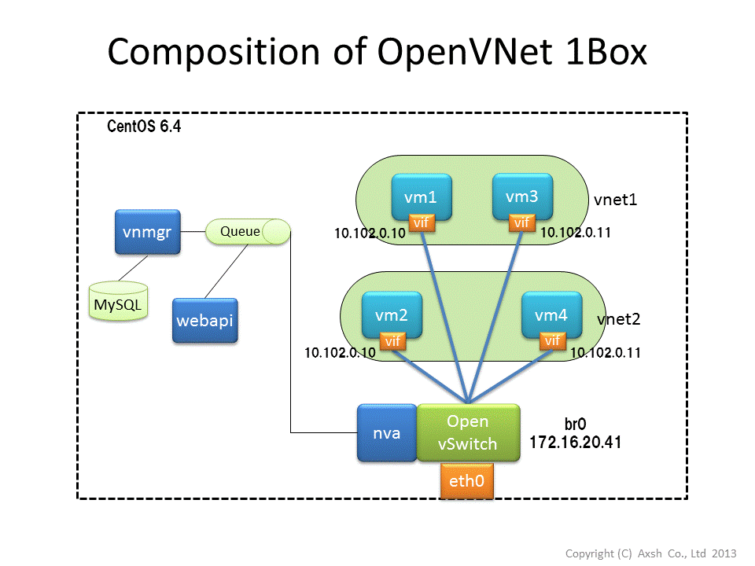

# OpenVNet #

# Preliminary Operations and Installation #

Installation Requirements
-------------------------

### System Requirements

+ RHEL 6.4
+ Kernel 2.6.32-358.6.2.el6.x86_64

### Network Requirements

+ Local Area Network (LAN)
+ Internet connection

Pre-setup
---------

Download the openvnet.repo file and put it to your /etc/yum.repos.d/ directory.

    # curl -o /etc/yum.repos.d/openvnet.repo -R https://raw.github.com/axsh/openvnet/master/openvnet.repo

Download the openvnet-third-party.repo file and put it in your /etc/yum.repos.d/ directory.

    # curl -o /etc/yum.repos.d/openvnet-third-party.repo -R https://raw.github.com/axsh/openvnet/master/openvnet-third-party.repo

Install epel-release.

    # rpm -Uvh http://dlc.wakame.axsh.jp.s3-website-us-east-1.amazonaws.com/epel-release

OpenVNet installation
------------------------

Install OpenVNet.

    # yum install -y wakame-vnet

Initial Configuration
---------------------

### Setup vnmgr

Modify the following section in /etc/wakame-vnet/vnmgr.conf on the vnmgr node.

    node {
      id "vnmgr"
      addr {
        protocol "tcp"
        host "192.168.100.2"
        port 9102
      }
    }

- **host** : The IP address or host name of the ZeroMQ node.
- **port** : The port number for connecting with ZeroMQ. If the vnmgr process is run on the same node as vna or webapi, specify a different value from vna and webapi.

### Setup vna

Modify the following section in /etc/wakame-vnet/vna.conf on the node.

    node {
      id "vna"
      addr {
        protocol "tcp"
        host "192.168.100.2"
        port 9103
      }
    }

- **host** : The IP address or host name of the ZeroMQ node.
- **port** : The port number for connecting with ZeroMQ. If the vna process is run on the same node as vnmgr or webapi, specify a different value from vnmgr and webapi.

### Setup webapi

Modify the following section in /etc/wakame-vnet/webapi.conf on the webapi node.

    node {
      id "webapi"
      addr {
        protocol "tcp"
        host "192.168.100.2"
        port 9101
      }
    }

- **host** : The IP address or host name of the ZeroMQ node.
- **port** : The port number for connecting with ZeroMQ. If the webapi process is run on the same node as vnmgr or vna, specify a different value from vnmgr and vna.

Configuring Database
--------------------

Modify the following section in /etc/wakame-vnet/common.conf on all nodes.

    db {
      adapter "mysql2"
      host "localhost"
      database "vnet"
      port 3306
      user "root"
      password ""
    }

- **host** : The IP address of the node running mysqld.
- **database** : The database name.
- **port** : The port number for connecting with mysqld. If necessary.
- **user** : The user name for connecting.
- **password** : The password for connecting.

Creating Database
-----------------

Before creating the database, you need to launch the mysql server.

    # service mysqld start

To automatically launch the mysql server, execute the following command.

    # chkconfig mysqld on

Create Database

    # mysqladmin -uroot create vnet
    # cd /opt/axsh/wakame-vnet/vnet
    # bundle exec rake db:init

Start the OpenVNet services
---------------------------

    # initctl start vnet-vnmgr
    # initctl start vnet-webapi
    # initctl start vnet-vna

OpenVNet writes its logs in the /var/log/wakame-vnet directory. If there's a problem starting any of the services, you can find its log files there.

---------------------------------------------------------------------

# Let's try 1Box OpenVNet#

This section explains how to install OpenVNet on one node. This is a great way to try it out.

Install the following operation system and kernel.

+ RHEL (or Centos) 6.4
+ Kernel 2.6.32-358.6.2.el6.x86_64

Installation and Setup of OpenVNet
-----------------------------------

### Network interfaces setup

We're going to enslave eth0 to openvswitch so OpenVNet can use it. You will no longer be able to use eth0 to ssh into the node or access the Internet. Prepare another interface for that if you need to.

    # vi /etc/sysconfig/network-scripts/ifcfg-eth0
    DEVICE=eth0
    DEVICETYPE=ovs
    TYPE=OVSPort
    OVS_BRIDGE=br0
    BOOTPROTO=none
    ONBOOT=yes
    HOTPLUG=no
    #
    # vi /etc/sysconfig/network-scripts/ifcfg-br0
    DEVICE=br0
    DEVICETYPE=ovs
    TYPE=OVSBridge
    ONBOOT=yes
    BOOTPROTO=static
    IPADDR=172.16.20.41
    NETMASK=255.255.255.0
    HOTPLUG=no
    OVS_EXTRA="
     set bridge     ${DEVICE} protocols=OpenFlow10,OpenFlow12,OpenFlow13 --
     set bridge     ${DEVICE} other_config:disable-in-band=true --
     set bridge     ${DEVICE} other-config:datapath-id=00004e6d2b508f4c --
     set bridge     ${DEVICE} other-config:hwaddr=02:01:00:00:00:01 --
     set-fail-mode  ${DEVICE} standalone --
     set-controller ${DEVICE} tcp:127.0.0.1:6633
    "

### OpenVNet package installation

Please install OpenVNet according to the "Pre-setup" and "OpenVNet installation" sections of "Preliminary Operations and Installation".

The config files (vnmgr.conf, vna.conf and webapi.conf) in the /etc/wakame-vnet directory do not need to be edited. They're set up for a single node installation by default.

### Other package installation

    # yum install qemu-kvm
    # yum install tcpdump

Start the required processes for OpenVNet
-----------------------------------------

### redis

    # chkconfig --list redis
    redis           0:off   1:off   2:off   3:off   4:off   5:off   6:off
    # chkconfig redis on
    # chkconfig --list redis
    redis           0:off   1:off   2:on    3:on    4:on    5:on    6:off
    # service redis start

### mysqld

    # chkconfig --list mysqld
    mysqld          0:off   1:off   2:off   3:off   4:off   5:off   6:off
    # chkconfig mysqld on
    mysqld          0:off   1:off   2:on    3:on    4:on    5:on    6:off
    # service mysqld start

Start OpenVNet
---------------
    # reboot
    #
    # initctl start vnet-vnmgr
    # initctl start vnet-webapi
    # initctl start vnet-vna
    # initctl list | grep vnet # <- This line confirms that all three processes have started successfully.
    vnet-vna start/running, process 2505
    vnet-vnmgr start/running, process 2286
    vnet-webapi start/running, process 2296

Download test environment
--------------------------

Download the test environment archive and unpack it in the /root directory. The size of this archive is about 1.3 GB.

     # curl -o /root/vnet-test-kvm.tgz -R http://dlc.openvnet.axsh.jp/tests/vnet-test-kvm.tgz
     # tar xvfz ./vnet-test-kvm.tgz

Create Database
----------------

Create the database and enter the sample data.

    # vi ~/.bash_profile
    PATH=$PATH:$HOME/bin -> PATH=$PATH:$HOME/bin:/opt/axsh/wakame-vnet/ruby/bin
    # source ~/.bash_profile
    # cd /root/vnet-test-kvm
    # ./db.sh

Reboot vna
-----------

    # initctl restart vnet-vna
    # initctl list | grep vnet # <- This line confirms that all three process have started successfully.
    vnet-vna start/running, process 2699
    vnet-vnmgr start/running, process 2286
    vnet-webapi start/running, process 2296

Check setup for OpenFlow
-------------------------

### openvswitch process

    # /etc/init.d/openvswitch status
    ovsdb-server is running with pid 868
    ovs-vswitchd is running with pid 877

### bridge

    # ovs-vsctl show
    70cf0a71-9413-4889-867c-d76d8e2b7ec4
        Bridge "br0"
            Controller "tcp:127.0.0.1:6633"
            fail_mode: standalone
            Port "eth0"
                Interface "eth0"
            Port "br0"
                Interface "br0"
                    type: internal
        ovs_version: "1.10.0"

### Initial Flow

Use the following command to check if flows have been applied

    # ovs-ofctl dump-flows br0

Below is an example of some flows you should see.

    NXST_FLOW reply (xid=0x4):
    cookie=0x900000000000001, duration=297.442s, table=0, n_packets=0, n_bytes=0, idle_age=297, priority=1,tun_id=0 actions=drop
     cookie=0x900000000000001, duration=297.442s, table=0, n_packets=0, n_bytes=0, idle_age=297, priority=2,in_port=CONTROLLER actions=write_metadata:0x2040000000000/0x20c0000000000
     cookie=0x500000000000003, duration=271.027s, table=0, n_packets=9, n_bytes=894, idle_age=97, priority=2,in_port=3 actions=write_metadata:0x700040000000002/0xff000c00ffffffff
    ...
    ...
    cookie=0xc00005100000006, duration=271.791s, table=65, n_packets=0, n_bytes=0, idle_age=271, priority=30,arp,metadata=0x700000000000006/0xff000000ffffffff,arp_op=2 actions=CONTROLLER:65535
     cookie=0xc00001100000008, duration=271.027s, table=65, n_packets=0, n_bytes=0, idle_age=271, priority=30,arp,metadata=0x700000000000008/0xff000000ffffffff,arp_op=1 actions=CONTROLLER:65535
     cookie=0xc00001100000005, duration=272.126s, table=65, n_packets=0, n_bytes=0, idle_age=272, priority=30,arp,metadata=0x700000000000005/0xff000000ffffffff,arp_op=1 actions=CONTROLLER:65535

Check Virtual Network Operation.
------------------------------------

### Start VM(s)

We use kvm to start four virtual machines. Their interfaces were registered in the database earlier. These VMs and their networks are arranged as follows.

+ vm1, vm3 -> vnet1
+ vm2, vm4 -> vnet2

The command "run-vm-all" starts all four virtual machines at once.

    # cd /root/vnet-test-kvm/vm
    # ./run-vm-all
    *** vm1 ***
    node-id: 1
    interface name: if-x5vjmksl
    mac address: 52:54:00:0d:84:8c
    *** vm2 ***
    node-id: 2
    interface name: if-sve1s6xp
    mac address: 52:54:00:9a:cc:00
    *** vm3 ***
    node-id: 3
    interface name: if-bvixz40n
    mac address: 52:54:00:0a:fb:78
    *** vm4 ***
    node-id: 4
    interface name: if-7st2alal
    mac address: 52:54:00:e5:f9:fb

### Check the IP address of virtual machines

You can log into the virtual machines using the telnet command.

    # telnet localhost PORT-NO

The port numbers are:

+ vm1 : 5001
+ vm2 : 5002
+ vm3 : 5003
+ vm4 : 5004

The ip addresses are assigned as follows. As you can see, vm1 and vm3, share the same ip address, as do vm2 and vm4.

+ vm1 : 10.102.0.10
+ vm2 : 10.102.0.10
+ vm3 : 10.102.0.11
+ vm4 : 10.102.0.11

Log into the virtual machines and make sure their ip addresses are correct.

**ex) vm1**

    # telnet localhost 5001 <- vm1
    Trying 127.0.0.1...
    Connected to localhost.
    Escape character is '^]'.

    CentOS release 6.4 (Final)
    Kernel 2.6.32-358.el6.x86_64 on an x86_64

    vm1 login: root
    Password:
    Last login: Thu Nov 28 21:06:57 on ttyS0
    [root@vm1 ~]# ip addr
    1: lo: <LOOPBACK,UP,LOWER_UP> mtu 16436 qdisc noqueue state UNKNOWN
        link/loopback 00:00:00:00:00:00 brd 00:00:00:00:00:00
        inet 127.0.0.1/8 scope host lo
        inet6 ::1/128 scope host
           valid_lft forever preferred_lft forever
    2: eth0: <BROADCAST,MULTICAST,UP,LOWER_UP> mtu 1500 qdisc pfifo_fast state UP qlen 1000
        link/ether 52:54:00:0d:84:8c brd ff:ff:ff:ff:ff:ff
        inet 10.102.0.10/24 brd 10.102.0.255 scope global eth0
        inet6 fe80::5054:ff:fe0d:848c/64 scope link
           valid_lft forever preferred_lft forever

### Check if the virtual networks work correctly

Use tcpdump to supervise the interfaces of vm3 (10.102.0.11) and vm4 (10.102.0.11). This is going to show us that only the virtual machines that are in the same virtual network will be able to reach each other.

**Run tcpdump on the node where you installed OpenVNet and supervise the interfaces of vm3 and vm4**

**vm3**

    [root@vm3 ~]# tcpdump -i if-bvixz40n
    tcpdump: WARNING: if-bvixz40n: no IPv4 address assigned
    tcpdump: verbose output suppressed, use -v or -vv for full protocol decode
    listening on if-bvixz40n, link-type EN10MB (Ethernet), capture size 65535 bytes

**vm4**

    [root@vm4 ~]# tcpdump -i if-7st2alal
    tcpdump: WARNING: if-7st2alal: no IPv4 address assigned
    tcpdump: verbose output suppressed, use -v or -vv for full protocol decode
    listening on if-7st2alal, link-type EN10MB (Ethernet), capture size 65535 bytes

**"ping" from vm1 to "10.102.0.11".**
You should see that the ping packets reach vm3 and not vm4.

**"ping" from vm2 to "10.102.0.11".**
This time you should see that the ping packets reach vm4 and not vm3.

---------------------------------------------------------------------

# License

---------------------------------------------------------------------

Copyright (c) Axsh Co. Components included are distributed under LGPL 3.0

