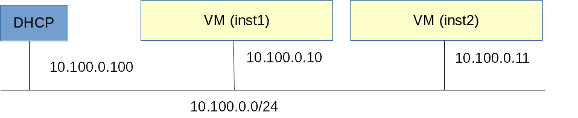

# Single network with DHCP server

## Overview

This document expects you to have set up OpenVNet according to the [installation guide](../installation) and created the simple [single network](single-network) afterwards. We will be continuing from there so complete those guides first.

All we are going to do in this guide is add a DHCP server. This will give us the following virtual network topology.



## Setup

### Create a simulated interface

OpenVNet will simulate DHCP entirely using [flows](../jargon-dictionary#flow) in Open vSwitch. However, the machines attached to OpenVNet's virtual networks will still expect a DHCP server to exist with a certain IP address. Therefore we need to tell OpenVNet to create a simulated interface that will give off the illusion of a real DHCP server.

```
vnctl interfaces add \
  --uuid if-dhcp \
  --mode simulated \
  --owner-datapath-uuid dp-test1 \
  --mac-address 02:00:00:00:01:11 \
  --network-uuid nw-test1 \
  --ipv4-address 10.100.0.100
```

### Create the DHCP service

Now that we have a simulated interface in place, next we need to tell OpenVNet to simulate a DHCP service on it.

```
vnctl network-services add --uuid ns-dhcp --interface-uuid if-dhcp --type dhcp
```

## Test

First of all let's have a look at VNA's log file.

```bash
tail /var/log/openvnet/vna.log
```

You should see something like this.

```
D, [2015-12-16T17:17:38.687225 #19913] DEBUG -- : 0x0000aaaaaaaaaaaa interface_manager: installing if-dhcp/3 (mode:simulated)
D, [2015-12-16T17:17:38.732223 #19913] DEBUG -- : 0x0000aaaaaaaaaaaa active_interface_manager: installing local/3 (interface_id:3 datapath_id:1 label:dp-test1)
D, [2015-12-16T17:17:38.741769 #19913] DEBUG -- : 0x0000aaaaaaaaaaaa interface/simulated: adding mac address to if-dhcp/3 (02:00:00:00:01:11)
D, [2015-12-16T17:17:38.763137 #19913] DEBUG -- : 0x0000aaaaaaaaaaaa interface/simulated: adding ipv4 address to if-dhcp/3 (02:00:00:00:01:11/10.100.0.100)
D, [2015-12-16T17:17:44.662743 #19913] DEBUG -- : 0x0000aaaaaaaaaaaa service_manager: installing ns-dhcp/1 (mode:dhcp)
```

Looking good so far. VNA seems to have created the simulated interface and added the DHCP service to it.

Log into `inst1` and have it do a DHCP request.

```bash
lxc-console -n inst1
service network restart
```

If everything went well, `inst1` should have received a DHCP reply and it now has IP address `10.100.0.10`

Taking another look at `/var/log/openvnet/vna.log` will show you how the simulated DHCP server has received the request and constructed a reply to it.

Now let's do the same on `inst2` and see how the DHCP service assigns `10.100.0.11`.

```bash
lxc-console -n inst2
service network restart
```

There we go. The two VMs can now ping each other again.

## What's next?

Now that you've successfully set up a single network and added a DHCP server to it, how about we set up [multiple networks](two-networks) next?
