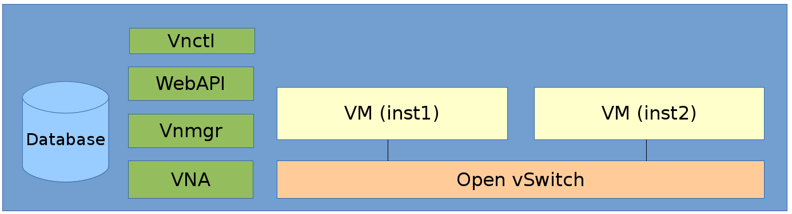

# OpenVNet Installation Guide

## Overview


Welcome to the world of OpenVNet! With this installation guide we help you
create a very simple yet innovative virtual network environment.

In this guide we are going to install all of OpenVNet's services into a single machine running CentOS. This can be a virtual machine. Afterwards we are going to use LXC to set up two containers that we'll connect to OpenVNet's virtual networks.




## Requirements

+ CentOS 6
+ Internet connection

## Installation

### Install OpenVNet Packages

Download the openvnet.repo file and put it to your `/etc/yum.repos.d/` directory.

```bash
curl -o /etc/yum.repos.d/openvnet.repo -R https://raw.githubusercontent.com/axsh/openvnet/master/deployment/yum_repositories/stable/openvnet.repo
```

Download the openvnet-third-party.repo file and put it in your `/etc/yum.repos.d/` directory.

```bash
curl -o /etc/yum.repos.d/openvnet-third-party.repo -R https://raw.githubusercontent.com/axsh/openvnet/master/deployment/yum_repositories/stable/openvnet-third-party.repo
```

Each repo has the following packages:

#### openvnet.repo
  * openvnet (metapackage)
  * openvnet-common
  * openvnet-vna
  * openvnet-vnmgr
  * openvnet-webapi
  * openvnet-vnctl

#### openvnet-third-party.repo
  * openvnet-ruby
  * openvswitch

Install epel-release.

```bash
yum install -y epel-release
```


Install OpenVNet packages.

```bash
yum install -y openvnet
```

`openvnet` is an metapackage that depends on `openvnet-common`, `openvnet-vna`, `openvnet-vnmgr`, `openvnet-webapi` and `openvnet-vnctl`. It's just a convenient way to install all of those at once.

Install [Redis](http://redis.io) and [MySQL server](https://www.mysql.com). Redis is required for OpenVNet's processes to communicate and MySQL for data storage. Though they're both required, they are not package dependencies because OpenVNet is distributed software. In a production environment, it is very likely for these packages to be installed on other machines than the OpenVNet processes themselves.

```bash
yum install -y mysql-server redis
```

### Setup Open vSwitch

We are going to create a bridge `br0` using Open vSwitch. Later we will attach our VMs `inst1` and `inst2` to this bridge.

Create the file `/etc/sysconfig/network-scripts/ifcfg-br0` with the following contents.

```bash
DEVICE=br0
DEVICETYPE=ovs
TYPE=OVSBridge
ONBOOT=yes
BOOTPROTO=static
HOTPLUG=no
OVS_EXTRA="
 set bridge     ${DEVICE} protocols=OpenFlow10,OpenFlow12,OpenFlow13 --
 set bridge     ${DEVICE} other_config:disable-in-band=true --
 set bridge     ${DEVICE} other-config:datapath-id=0000aaaaaaaaaaaa --
 set bridge     ${DEVICE} other-config:hwaddr=02:01:00:00:00:01 --
 set-fail-mode  ${DEVICE} standalone --
 set-controller ${DEVICE} tcp:127.0.0.1:6633
"
```

**Remark:** Notice how we set the `datapath-id` to `0000aaaaaaaaaaaa`? This is a unique ID that OpenVNet will use to recognise this bridge later. You can set it to any 16 hex digits of your choosing but make sure to remember it for later.

Start the `openvswitch` service and bring  up the bridge.

```bash
service openvswitch start
ifup br0
```

### Setup Database

Edit `/etc/openvnet/common.conf` if necessary. The sample environment uses the default settings.

Launch MySQL server.

```bash
service mysqld start
```

Create database

```bash
cd /opt/axsh/openvnet/vnet
/opt/axsh/openvnet/ruby/bin/bundle exec rake db:create
/opt/axsh/openvnet/ruby/bin/bundle exec rake db:init
```

### Start redis

As mentioned above, OpenVNet services use redis to communicate with each other.

```bash
service redis start
```

### Start OpenVNet services

Start vnmgr and webapi.

```bash
initctl start vnet-vnmgr
initctl start vnet-webapi
```

We use `vnctl` to create the database records subsequent to the above configurations. `vnctl` is Web API client offered by the `openvnet-vnctl` package.

Remember the `datapath-id` we set when setting up Open vSwitch? Now we're going tell OpenVNet to manage this datapath using vna.

```bash
vnctl datapaths add --uuid dp-test1 --display-name test1 --dpid 0x0000aaaaaaaaaaaa --node-id vna
```

* dpid

The datapath ID specified in `/etc/sysconfig/network-scripts/ifcfg-br0`

* node-id

The ID of the vna written in `/etc/openvnet/vna.conf`. In a production environment, it's very likely for OpenVNet to span multiple hosts, each with their own Open vSwitch and vna combo. Therefore we need to tell OpenVNet which vna will manage which datapath. For this simple installation we have only one vna so we use the default `node-id` without editing `vna.conf`.

Now let's start vna.

```bash
initctl start vnet-vna
```

The log files are created in the /var/log/openvnet directory. Refer to them if something bad happens. You can run `ovs-vsctl show` to check if vna is working correctly.

You should be able to see `is_connected: true` in its output.

```bash
fbe23184-7f14-46cb-857b-3abf6153a6d6
    Bridge "br0"
        Controller "tcp:127.0.0.1:6633"
            is_connected: true
```

## LXC Setup

We now have OpenVNet set up and working but we don't have any virtual machines connected to it yet. In this step we are going to use [LXC](https://linuxcontainers.org) to create the two virtual machines `inst1` and `inst2` that will be connected to OpenVNet's virtual networks.

Any virtualization techonology will work but in this guide we're using LXC because it's lightweight and can easily be set up inside virtual machines as well.

Install LXC

```bash
yum -y install lxc lxc-templates
```

Create and mount cgroup

```bash
mkdir /cgroup
echo "cgroup /cgroup cgroup defaults 0 0" >> /etc/fstab
mount /cgroup
```

Create 2 LXC guests. Rsync is required for this. If it's not installed already, install it with the following command.

```bash
yum install -y rsync
```

```bash
lxc-create -t centos -n inst1
lxc-create -t centos -n inst2
```

Configure interfaces of each guest

```bash
vi /var/lib/lxc/inst1/config

lxc.network.type = veth
lxc.network.flags = up
lxc.network.veth.pair = inst1
lxc.network.hwaddr = 10:54:FF:00:00:01
lxc.rootfs = /var/lib/lxc/inst1/rootfs
lxc.include = /usr/share/lxc/config/centos.common.conf
lxc.arch = x86_64
lxc.utsname = inst1
lxc.autodev = 0
```

```bash
vi /var/lib/lxc/inst2/config

lxc.network.type = veth
lxc.network.flags = up
lxc.network.veth.pair = inst2
lxc.network.hwaddr = 10:54:FF:00:00:02
lxc.rootfs = /var/lib/lxc/inst2/rootfs
lxc.include = /usr/share/lxc/config/centos.common.conf
lxc.arch = x86_64
lxc.utsname = inst2
lxc.autodev = 0
```

Make sure that the IPv4 address and MAC address are the same as what you specify when you create the interface database records.

Launch the LXC guests then enslave the LXC's tap interfaces to the datapath.

**Remark:** We do not use `lxc.network.link` parameter because the Linux bridge is replaced by the Open vSwitch. That parameter expects to interface with the Linux bridge and containers will fail to start if you attempt to use it with Open vSwitch. We'll enslave the tap interfaces manually.

```bash
lxc-start -d -n inst1
lxc-start -d -n inst2

ovs-vsctl add-port br0 inst1
ovs-vsctl add-port br0 inst2
```

Now the LXC's network interfaces are attached to the Open vSwitch. This is basically the same as plugging a network cable into a physical switch.

Congratulations. You have now installed OpenVNet and you're ready to start building your first virtual network. We recommend you start with the simplest possible setting: [Single Network](single-network).
