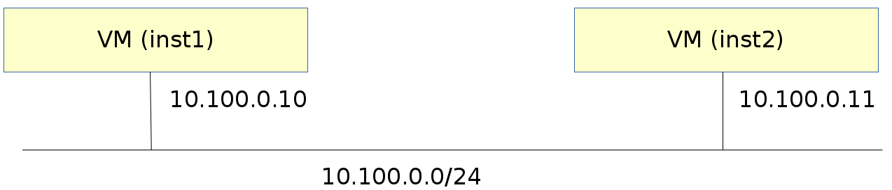

# Single network

## Overview

This is the simplest possible setup after the installation guide. It's a great start for when you're just getting into OpenVNet.

This document expects you to have set up OpenVNet according to the [installation guide](installation). We will be referring to the VMs `inst1` and `inst2` as they've been set up in there.

We are going to use them to create the following virtual network topology.



We will just have one simple network: `10.100.0.0/24`.

* Inst1's IP address: `10.100.0.10`
* Inst2's IP address: `10.100.0.11`

## Setup

### Create the network

```
vnctl networks add \
  --uuid nw-test1 \
  --display-name testnet1 \
  --ipv4-network 10.100.0.0 \
  --ipv4-prefix 24 \
  --network-mode virtual
```

### Set up the interfaces

Now that we have a virtual network, we need to tell OpenVNet which interfaces are in it and which IP addresses they will get. We need to do this for both `inst1` and `inst2`.

```
vnctl interfaces add \
  --uuid if-inst1 \
  --mode vif \
  --owner-datapath-uuid dp-test1 \
  --mac-address 10:54:ff:00:00:01 \
  --network-uuid nw-test1 \
  --ipv4-address 10.100.0.10 \
  --port-name inst1

vnctl interfaces add \
  --uuid if-inst2 \
  --mode vif \
  --owner-datapath-uuid dp-test1 \
  --mac-address 10:54:ff:00:00:02 \
  --network-uuid nw-test1 \
  --ipv4-address 10.100.0.11 \
  --port-name inst2
```

For more information about the interfaces commands, visit [their section](vnctl-interfaces.md) in the Vnctl documentation.

## Test

Log into `inst1` and check its IP address configuration.

```bash
lxc-console -n inst1
ip a
```

If everything went well you will see that it has no IP address assigned to it. That is to be expected. The network we have just set up does not have a DHCP server. Assign the IP address manually.

```bash
ip addr add 10.100.0.10/24 dev eth0
```

Now open another terminal and do the same for `inst2`.

```bash
lxc-console -n inst2
ip addr add 10.100.0.11/24 dev eth0
```

Now that both have their IP address set up, you can try having them ping each other. Since we just logged into `inst2`, let's ping `inst1` from there.

```bash
ping 10.100.0.10
```

If everything went well, ping should now be working. If not, review all the steps to make sure you didn't make any mistakes.

## Remark

Now that we've set up this virtual network and tested it, it's a good time to tell you about a difference between traditional networks and OpenVNet's virtual networks.

Let's see what happens when we change `inst2`'s IP address to `10.100.0.15/24`

```bash
ip addr del 10.100.0.11/24 dev eth0
ip addr add 10.100.0.15/24 dev eth0
```

Now try pinging `inst1` again.

```bash
ping 10.100.0.10
```

What do you see? Ping no longer works.

On a tradition network, changing the IP address to anywhere within `10.100.0.0/24` would work but OpenVNet is more strict. We have registered `inst2` in OpenVNet's database with IP address `10.100.0.11` and OpenVNet will not allow it to use anything else.
